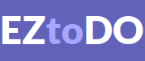

 

  

<h3 align="center">EZtoDO</h3>
  

    A simple todo list that uses the local storage to store todos and projects
  

## Table of Contents

- [About The Project](#about-the-project)
  - [Objectives](#objectives)
  - [Tools Used](#tools-used)
  - [Features](#features)
- [Installation](#installation)
- [Live Github page](#live-github-page)
- [What I Learned](#what-i-learned)
- [Future updates](#future-updates)
- [Credits](#credits)

## About The Project

This was a practice project made with some objectives in mind. I took some long breaks during the development process which resulted
in this project spanning around 5 months. I think I learned a lot from this project. The main challenge I faced with this project was making it modular. Having different modules handle specfic parts of the project made things complicated and I really had to think of the structure of the program.

### Objectives

- Learn how to separate programs into different modules
- Configure **webpack** for verstaility (dev and prod)
- Get used to organizing different source code files
- Learn about UX design for apps
- Use **localStorage** provided by browsers to store and load objects
- Use **date-fns** to format dates and work with them

### Tools Used

- HTML5
- Javascript
- CSS
- NPM
- Webpack
- [date-fns][date-fns-url]

### Features

- Storage that retains tasks and projects between sessions
- Default "Home" project for adding unrelated todos
- Easy creation of new projects that have their own todos
- View all projects and their stats (Number of todos, completed todos, overdue todos, etc.)
- View todos due today
- View todos due this week
- Star todos and view all starred todos
- Identify overdue todos easily (highlighted)
- Edit todos and change their properties
- View details of todos in just a click

(<a href="#top">back to top</a>)

## Installation

If you wish to build the project locally:

- First clone the repo in your local machine

- Install dependecies using: `npm install`

- Then use this script: `npm run build`

- The app will be built in `dist` which you can then open using a browser

(<a href="#top">back to top</a>)

## Live Github page

The app has been deployed live using `gh-pages`: [EZtoDO][repo]

![page.png][page-image]

(<a href="#top">back to top</a>)

## What I Learned

In the process of developing EZtoDO, I have gained a lot of valuable experience and I believe I completed the objectives I had. These are the highlights:

- **Designing structure:** I learned how to design the structure of the program and make different modules interact with each other with encapsulate code.

- **Organizing codebase:** I wouldn't dare say the codebase is completely organized but I **_had_** to organize a lot of it as it grew in scale which improved my project organizing.

- **Using documentations:** Another important skill I learned during this project was effectively using documentations. I had to rely on documentations for using tools like `localStorage` and [date-fns][date-fns-url] which made me more comfortable traversing through different documentations.

- **Handling dates:** Another thing I am more comfortable now is handling dates. I had to compare dates for figuring out what todos were overdue or filter todos based on their due date which was made easy by `date-fns`.

- **JSON:** I also learned more about parsing and storing in **JSON** format since I had to load and parse objects from `localStorage` (which uses **JSON**).

- **UX Design:** When testing and using the app I had to think from the perspective of the user and build things appropriately which improved my UX designing.

- **Documenting projects:** Writing this README.md has made me a bit more proficient in documenting the journey of project and effectively communicating my experience .

(<a href="#top">back to top</a>)

## Future updates

- **Refactoring & organizing:** The code really needs to be refactored and organized more.
- **Sorting:** There is no feature for sorting the todos right now which would be great for the user.
- **Rework modules:** Some of the modules for example: `DOM.js` are really inflexible and need to be improved.
- **Separate stylesheet:** The current styles of the project are all in one stylesheet which is very messy so it needs to be separated into different stylesheets for different parts.
- **Better layout:** A lot of the current layout of the app is hardcoded and might not work in different devices this needs to be made responsive.
- **Add notes:** Notes would be another handy tool that goes well with a todo list and improve user experience.
- **Customize project & labels:** Allow users to customize the project (names, description etc.) and add custom labels.

(<a href="#top">back to top</a>)

## Credits

- [All icons By Icons8][Icons8-credit]

(<a href="#top">back to top</a>)

<!-- LINKS -->

[repo]: https://imaginepog.github.io/todo-list/
[page-image]: src/assets/images/page.png
[date-fns-url]: https://date-fns.org/
[Icons8-credit]: https://icons8.com
